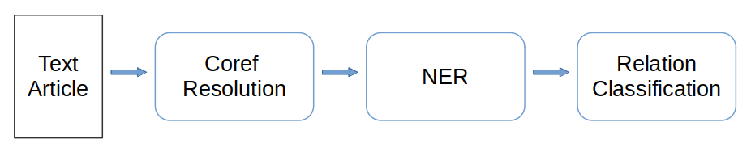

# Simple Relation Graph Extractor

This app extract entity objects and its relation between.

The entities consist of **PER:person**, **ORG:Organization** and **LOC:Location**.

The relations extracted are **'located at'**, **'member of'** and **'origin'**.

## How is the system works

The text article will be processed to resolve the coreference in pronouns or nouns, after that we detect the entities in every sentence and at the end we classify the relation for each sentence consisting at least two detected entities.

For coreference resolution model, I use neuralcoref from huggingface and spacy 2.1.0. ( Thanks a lot [Huggingface 🤗](https://huggingface.co/) and [Spacy](https://spacy.io/) )

For NER and Relation Classifier, I trained distilbert using conllpp and KPB7 dataset for each task respectively. 

## Here a demo of the app

## To run the apps
### 1. Run the API

- install docker if you haven't
- cd to inside folder API/
- run `docker-compose up --build`

### 2. Run Streamlit app

- cd to inside folder Streamlit_UI
- run `streamlit run realation_app.py --server.port [PORT_NUMBER]`